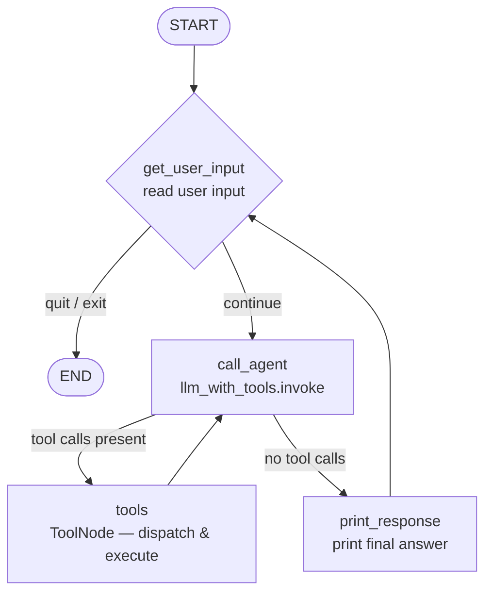

# LangGraph Tool-Handling Agent — System Diagram

## Graph



## Nodes

| Node | Type | Role |
|------|------|------|
| `get_user_input` | Custom | Reads one line from `stdin`. Returns a `HumanMessage` appended to history, or sets `should_exit=True`. |
| `call_agent` | Custom | Sends the full message history to `llm_with_tools.invoke()`. The LLM decides whether to call tools or answer directly. |
| `tools` | `ToolNode` (prebuilt) | Receives tool call requests from the LLM, dispatches to the correct function (`get_weather`, `calculator`, or `count_letter`), and appends `ToolMessage` results. |
| `print_response` | Custom | Prints the last `AIMessage` (the assistant's final answer) and returns control to `get_user_input`. |

## Edges

| From | To | Condition |
|------|----|-----------|
| `START` | `get_user_input` | Always |
| `get_user_input` | `END` | `should_exit == True` |
| `get_user_input` | `call_agent` | `should_exit == False` |
| `call_agent` | `tools` | LLM response contains tool calls |
| `call_agent` | `print_response` | LLM response is a final answer (no tool calls) |
| `tools` | `call_agent` | Always — LLM sees tool results and either calls more tools or answers |
| `print_response` | `get_user_input` | Always — loop back for the next user turn |

## State

```python
class AgentState(TypedDict):
    messages: Annotated[list, add_messages]  # append reducer — full history
    should_exit: bool
```

`add_messages` is LangGraph's built-in reducer. Each node returns only the new messages; the graph merges them into the growing list. This means `call_agent` always sees the complete conversation — including prior user turns, tool results, and assistant replies — enabling genuine multi-turn memory without any manual history management.

## Checkpointing

The graph is compiled with `SqliteSaver`, which snapshots the full `AgentState` after every node execution. On restart, passing `{}` as the initial state with the same `thread_id` instructs LangGraph to load the last checkpoint — restoring the full message history transparently.

```
sessions.db
└── checkpoints table
    ├── thread_id: "20260301_143022"   ← session identifier
    ├── checkpoint: <serialized AgentState>
    └── ...
```
